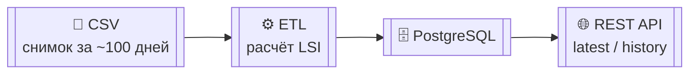
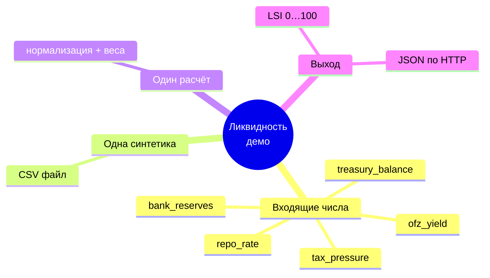
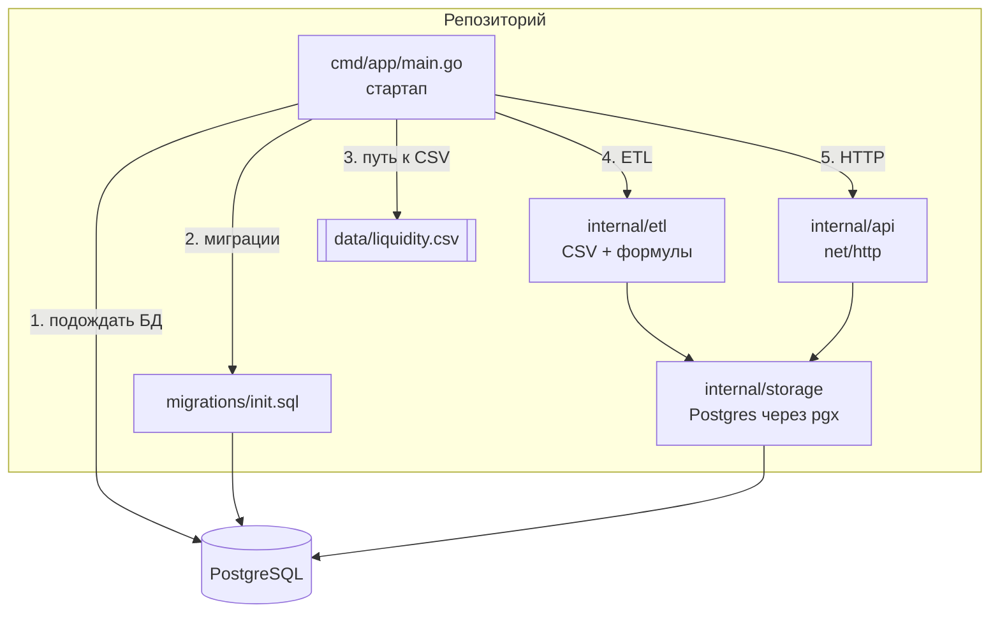
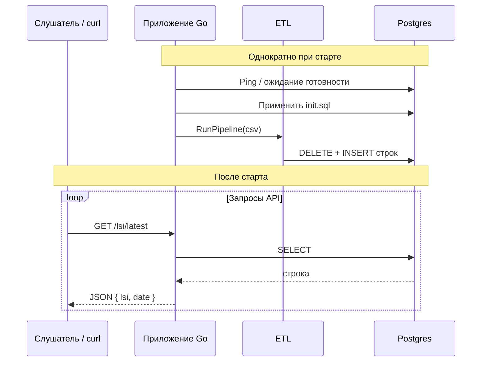
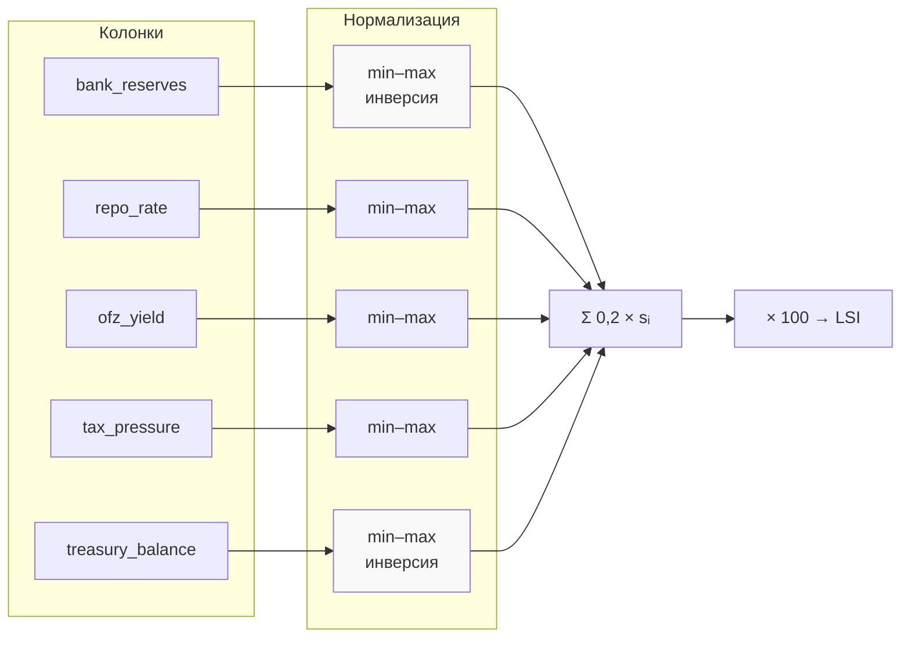

# Вступление к демо: Индекс ликвидностного стресса (LSI)

Материал для **начала занятия** — чтобы аудитория заранее понимала: *что показываем*, *из чего состоит система* и *как данные текут сквозь неё*. Можно прокручивать как один документ или разбить на слайды по заголовкам уровня 2 (`## …`).

---

## Слайд 1 — Зачем это нужно в рамках мастер-класса

- **Цель демонстрации** — показать типичный путь в аналитике: *сырой снимок данных* → *обработка* → *хранилище* → *API для потребления*.
- **Не цель** — построить production-систему, ML-модели, потоковую архитектуру или торговые интеграции.
- **Метафора**: «маленький завод»: на вход даём CSV с днями и цифрами, на выходе получаем **один понятный индекс от 0 до 100** и HTTP-ответы для проверки.

Визуально весь процесс можно свести к одной линии:



---

## Слайд 2 — Бизнес-контекст (упрощённо)

Финансовые рынки и казначейство опираются на **ликвидность** — возможность без лишних потерь обслуживать поток платежей, репо, выпуск долга и налоговые поступления. Когда **резервы и свободные остатки** сдавливаются, а **стоимость заимствования** и **доходность облигаций** давят «вверх», «стресс» растёт.

В демо мы **не** подключаемся к биржам. Мы симулируем **ежедневные индикаторы** и на их основе считаем **агрегатный балл напряжения** — **Liquidity Stress Index (LSI)**.



---

## Слайд 3 — Какие поля в данных (вход CSV / таблица БД)

Одна строка — **один календарный день**:

| Поле (в системе) | Интуитивный смысл для объяснения |
|------------------|----------------------------------|
| `date` | День наблюдения |
| `bank_reserves` | Объём резервной ликвидности в системе |
| `repo_rate` | Условная «дороговизна» краткого финансирования (репо) |
| `ofz_yield` | Условная доходность госдолга (ОФЗ) |
| `tax_pressure` | Налоговое давление / оттоки в бюджет (агрегат в демо) |
| `treasury_balance` | Остатки/ресурсы казначейства |

На выходе ETL добавляется вычисляемое поле **`lsi`** и всё сохраняется в таблице `lsi_data`.

---

## Слайд 4 — Архитектура решения «как код»



**Порядок при запуске (например, в Docker)**:

1. Процесс **живёт**, пока не ответит Postgres.
2. Выполняется **DDL** из `migrations/init.sql` (таблица + индекс).
3. При необходимости **генерируется** отсутствующий CSV.
4. **ETL** читает CSV, считает LSI, делает **очистку строк** и повторную загрузку (удобно для повторных демо).
5. Поднимается **HTTP** на порту **8080** (в compose проброшен на хост).



---

## Слайд 5 — Что считает ETL (логика без кода)

1. По **каждой колонке** с числами (кроме даты) берутся минимум и максимум **по всему файлу**.
2. Каждое значение переводится в отрезок \([0,1]\):  
   \(\text{масштаб} = \dfrac{x - x_{\min}}{x_{\max}-x_{\min}}\)  
   (если колонка «плоская», делитель не ноль — техническая защита).
3. Для **резервов** и **казначейского баланса** применяется **инверсия**: ниже резервов/казны относительно окна ⇒ **больший вклад стресса** (используется \(1 - \text{масштаб}\)).
4. **Итог LSI**:  
   \[
   \text{LSI} = 100 \times \sum_{i=1}^{5} (0{,}2 \cdot s_i),
   \]  
   где \(s_i\) — нормализованные «вклады стресса» по каждому из пяти показателей. Коэффициенты **в сумме дают 1**, поэтому до умножения на 100 взвешенная сумма лежит в **\[0,1\]**.



Важное **оговорка для аудитории**: нормализация по **локальному окну CSV** не равняется «абсолютной шкале экономики всей истории». Это **педагогически понятная** нормализация на демонстрационном интервале.

---

## Слайд 6 — Контракт API (что показать живьём)

| Метод и путь | Ответ по смыслу |
|----------------|----------------|
| `GET /health` | Текст `OK`, что процесс отвечает |
| `GET /lsi/latest` | Одна последняя по дате запись: `lsi`, `date` |
| `GET /lsi/history` | До **30** последних наблюдений в JSON-массиве |

Пример того, как объяснять связь экран ↔ сервис:

```mermaid
flowchart LR
  subgraph Клиент
    B["Браузер / curl"]
  end
  subgraph Сервер ":8080"
    H[/health /]
    L[/lsi/latest /]
    Y[/lsi/history /]
  end

  B --> H
  B --> L
  B --> Y
  L --> J1["{\"lsi\": …, \"date\": \"…\"}"]
```

---

## Слайд 7 — Запуск в одну команду (для финала вступления)

Из корня проекта поднимите стек сборкой и приложением по адресу **http://localhost:8080**:

```bash
docker-compose up --build
```

Краткая «шпаргалка» после старта:

```bash
curl -s http://localhost:8080/health
curl -s http://localhost:8080/lsi/latest
curl -s http://localhost:8080/lsi/history
```

---

## Слайд 8 — Осознанные ограничения (чтобы задать правильные ожидания)

- **Не** realtime-поток, **не** микросервисы и **не** очередь событий.
- Один синхронный **ETL** при старте; при каждом запуске данные из CSV **перезаписываются** целиком.
- Нет авторизации по HTTP — только для локального/учебного контура.

---

## Как использовать файл в режиме «презентация»

- **Разбивка**: каждый блок `---` можно трактовать как границу между слайдами; заголовки `## Слайд N` — текст на слайд.
- **Диаграммы**: блоки ```mermaid … ``` рендерятся в GitHub, GitLab, многих Markdown-просмотрщиках и в **Obsidian**. Для **Marp**: включите поддержку Mermaid в настройках или экспортируйте после рендеринга.
- **Редактирование**: при необходимости уберите технические секции или оставьте только слайды **1**, **4**, **5**, **7** как «ультракороткую версию».

---

## Связанные файлы проекта

- Подробная инструкция по сборке и структуре — `README.md` в корне.
- CSV — `data/liquidity.csv`
- Конвейер — `internal/etl/pipeline.go`
- API — `internal/api/router.go`
- Инфраструктура — `docker-compose.yml`, `Dockerfile`

Удачи с занятием.
